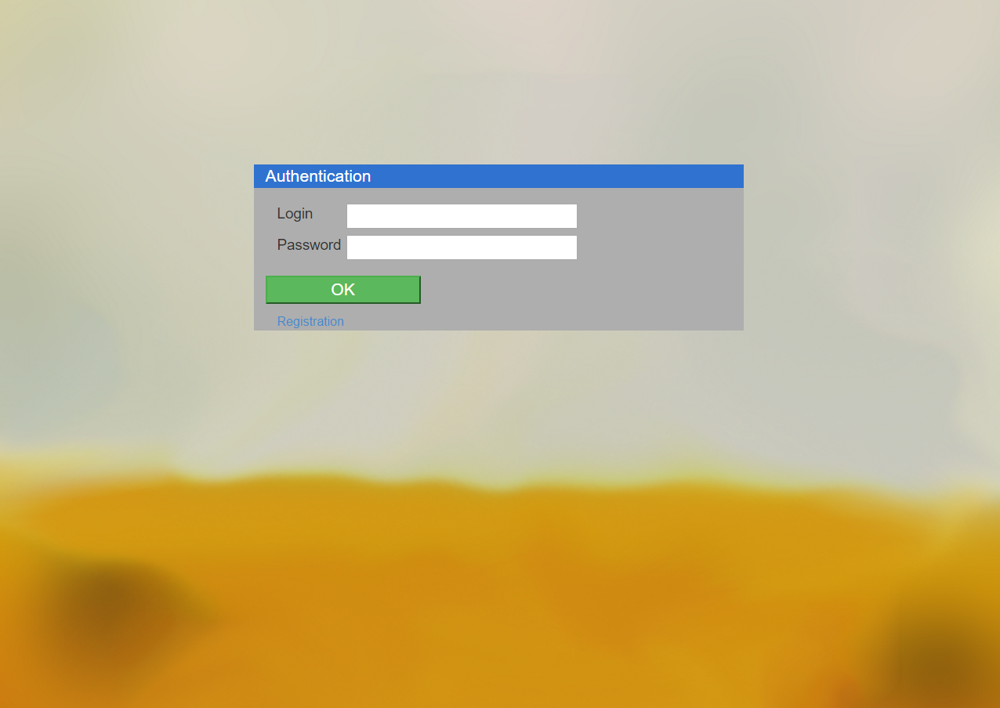
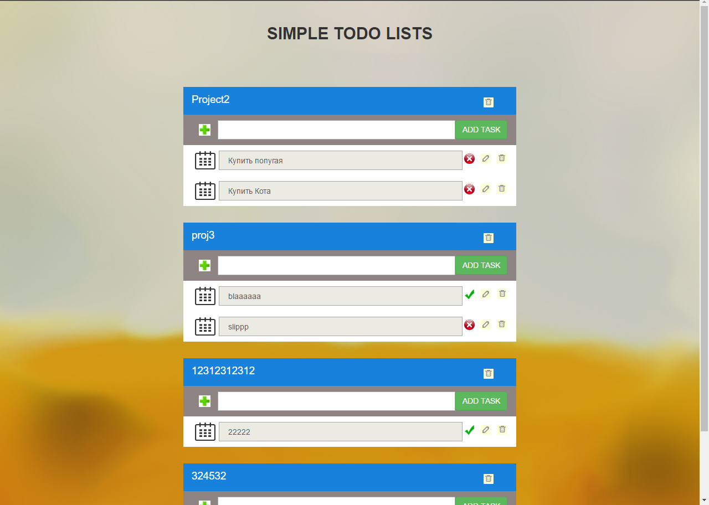

# ToDoList
Task manager 

Functional requirements:
★  user authentication/registration
★  create/delete projects 
★  add tasks to my project 
★  update/create/delete tasks  
★  mark a task as 'done' 

Use SQL tables:
★ tasks (id, name, status,date, project_id)
★ projects (id, name, user_id)
★ users (id, login, password)

